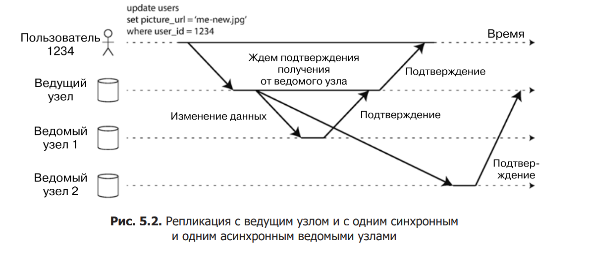

# Отказоустойчивые приложения

Узлы, в которых хранятся копии БД, называются *репликами*.

Каждая операция записи в базу должна учитываться каждой репликой, иначе нельзя гарантировать, что реплики содержат одни и те же данные. Наиболее распространенное решение этой проблемы называется репликацией с ведущим узлом (**leader-based replication**)

1. Одна из реплик назначается ведущим (leader) узлом. Клиенты, желающие записать данные в базу, должны отправить свои запросы ведущему узлу, который сначала записывает новые данные в свое локальное хранилище.
2. Другие реплики называются ведомыми (followers) узлами . Всякий раз, когда ведущий узел записывает в свое хранилище новые данные, он также отправляет информацию об изменениях данных всем ведомым узлам в качестве части журнала репликации (replication log) или потока изменений (change stream). Все ведомые узлы получают журнал от ведущего и обновляют соответствующим образом свою локальную копию БД, применяя все операции записи в порядке их обработки ведущим узлом.
3. Когда клиенту требуется прочитать данные из базы, он может выполнить запрос или к ведущему узлу, или к любому из ведомых. Однако запросы на запись разрешено отправлять только ведущему (ведомые с точки зрения клиента предназначены только для чтения).

- На примере из рис. 5.2 репликация на ведомый узел 1 синхронна: ведущий узел ждет до тех пор, пока ведомый узел 1 не подтвердит получение операции записи, прежде чем сообщить пользователю об успехе и сделать результаты записи видимыми другим клиентам ( пример реализации - цепная репликация (chain replication)).
- Репликация на ведомый узел 2 асинхронна: ведущий узел отправляет сообщение, но не ждет ответа от ведомого.

## Преимущества и недостатки

**Зачастую репликация с ведущим узлом делается полностью асинхронной.**

Преимущество синхронной репликации: копия данных на ведомом узле гарантированно актуальна и согласуется с ведущим узлом. В случае внезапного сбоя
последнего можно быть уверенным, что данные по-прежнему доступны на ведомом узле. Недостаток же состоит в следующем: если синхронный ведомый узел
не отвечает (из-за его сбоя, или сбоя сети, или по любой другой причине), то
операцию записи завершить не удастся. Ведущему узлу придется блокировать
все операции записи и ждать до тех пор, пока синхронная реплика не станет снова доступна.

На практике активизация в СУБД синхронной репликации обычно означает, что один из ведомых узлов — синхронный, а остальные — асинхронны. В случае замедления или недоступности синхронного ведомого узла
в него превращается один из асинхронных ведомых узлов. Это гарантирует наличие актуальной копии данных по крайней мере на двух узлах: ведущем и одном
синхронном ведомом. Такая конфигурация иногда называется ***полусинхронной***
(semi-synchronous)

## Создание новых ведомых узлов

1. Сделать согласованный снимок состояния БД ведущего узла на определенный
момент времени — по возможности без блокировки всей базы. В большинстве
баз такая возможность есть, так как она нужна и для резервного копирования.
2. Скопировать снимок состояния на новый ведомый узел.
3. Ведомый узел подключается к ведущему и запрашивает все изменения данных,
произошедшие с момента создания снимка. 
    - Для этого нужно, чтобы снимок состояния соотносился с определенной позицией в журнале репликации ведущего узла.
4. Когда ведомый узел завершил обработку изменений данных, произошедших смомента снимка состояния, говорят, что он наверстал упущенное. После этого он может
продолжать обрабатывать поступающие от ведущего узла изменения данных.

## Отказ ведомого узла:

Ведомые узлы хранят журнал изменений от ведущего узла локально. При сбое или отключении ведомый узел может восстановить работу, используя последнюю записанную транзакцию в журнале и запросив у ведущего узла все пропущенные изменения.

## Отказ ведущего узла:

При отказе ведущего узла нужно повысить один из ведомых до ведущего и перенастроить систему. Этот процесс -  восстановлением после отказа (failover) может быть ручным или автоматическим. Автоматическое восстановление включает следующие шаги:

1. Определить отказ ведущего узла через таймаут: если узел не отвечает определенное время (например, 30 секунд), он считается отказавшим.
2. Выбрать новый ведущий узел через голосование реплик или через контроллер. Лучший кандидат - реплика с самыми свежими данными.
3. Перенастроить систему: направить запросы клиентов на новый ведущий узел и убедиться, что старый ведущий, если восстановится, признает новую конфигурацию.
