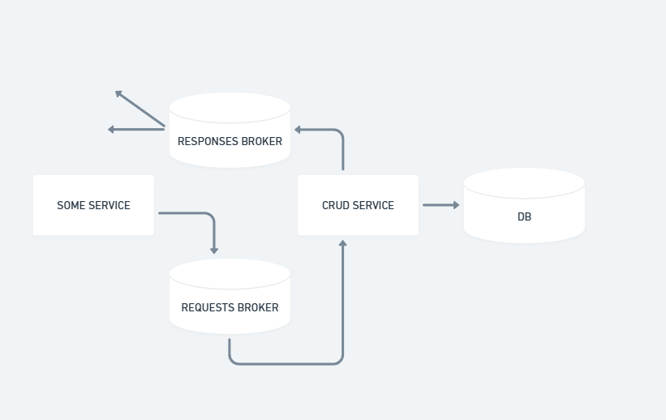

# Questions

# Для чего нужны БД

Для того чтобы делегировать задачу хранения от приложения стороннему сервису, а в случае распределённых систем - вынести логику синхронизации состояний инстансов в стороннее готовое решение.

# Проблемы высоконагруженных БД

- В случае SQL запись занимает больше времени из-за транзакционности и блокировок строк и таблиц
- Машина может буквально не справиться с большим количеством запросов
- Сложность анализа логов - сложнее обнаруживать неконсистентные данные

# Способы решения

- В случае одного узла (худший способ в современной действительности из-за дешевизны поднятия РСУБД в облачных сервисах и простоты этого процесса) - увеличение мощности узла
    - (-) сложно масштабировать
    - (-) отсутствие отказоустойчивости
    - (+) дешево
- В случае РСУБД - увеличение количества реплик
    - (-) дороже, чем одна реплика
    - (-) необходима оркестрация, больше расходов на администрирование
    - (+) легко масштабировать
- Использование асинхронного подхода
    - (-) самый дорогой способ
    - (-) сложность инфраструктуры
    - (+) способно выдержать максимальную нагрузку 
    
- Использование другого типа(метода, дизайна) баз данных(NoSQL)
    - (+) Лёгкость и гибкость в масштабировании.
    - (+) Возможность в горизонтальном расширении БД.
    - (+-) NoSQL-подход использует нерелативные БД для реализации - т.е. данные не будут структурированы в чётком порядке, что сокращает круг уместного использования подобного подхода. 
